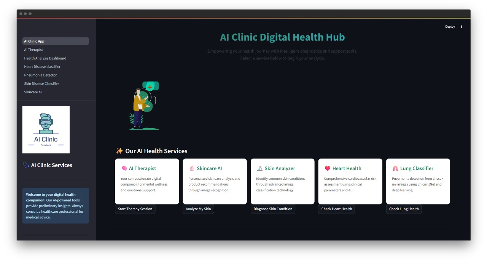
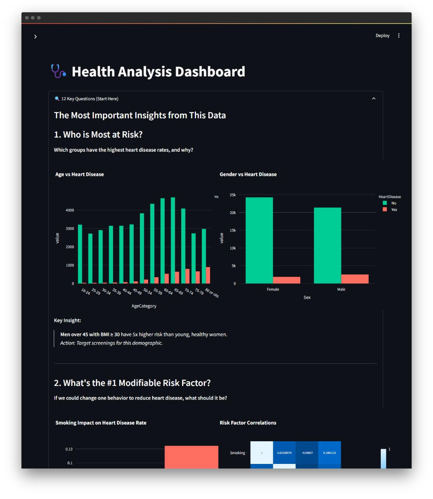
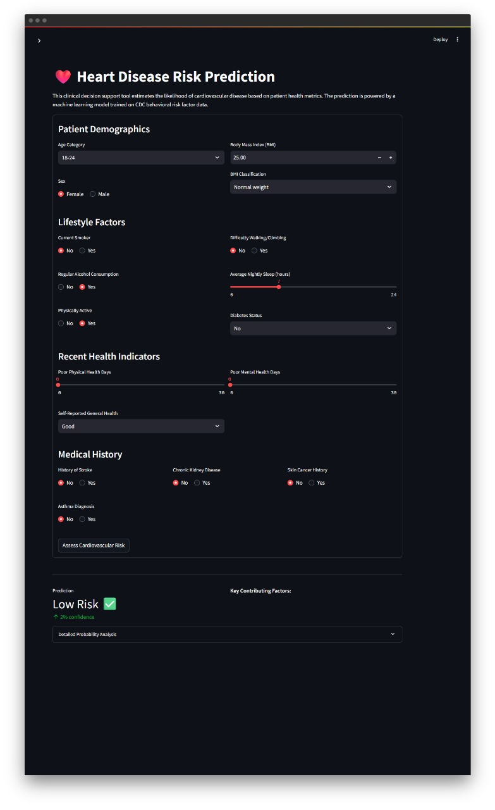
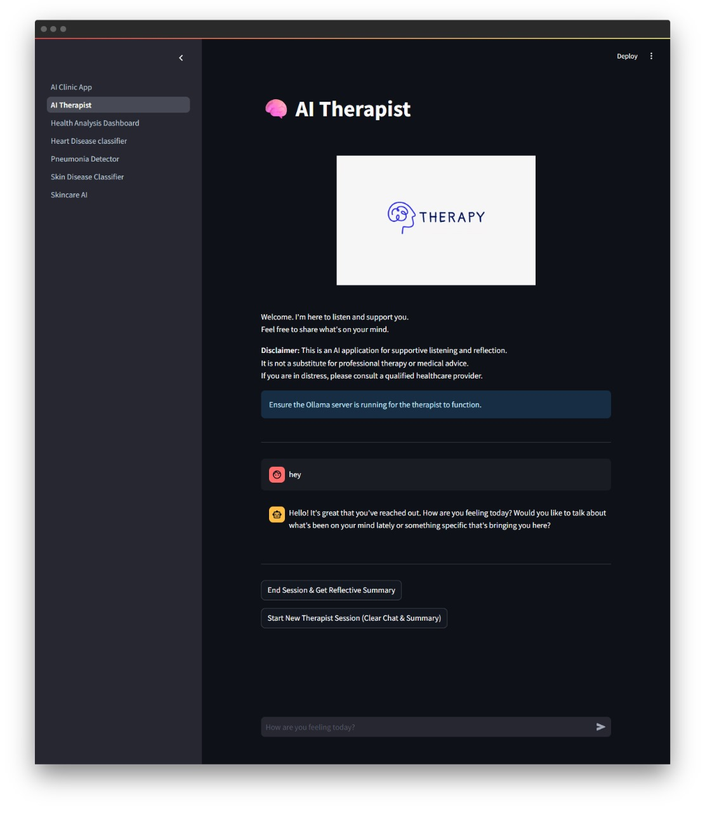
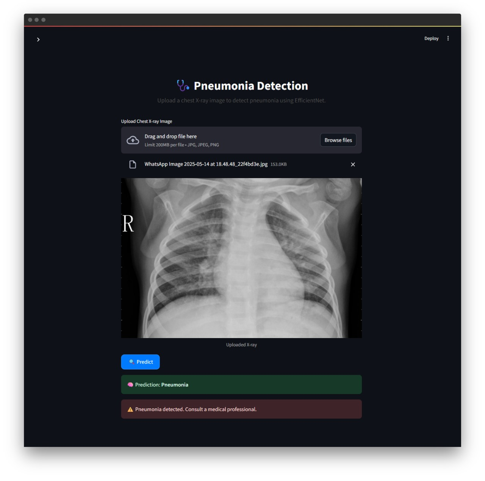
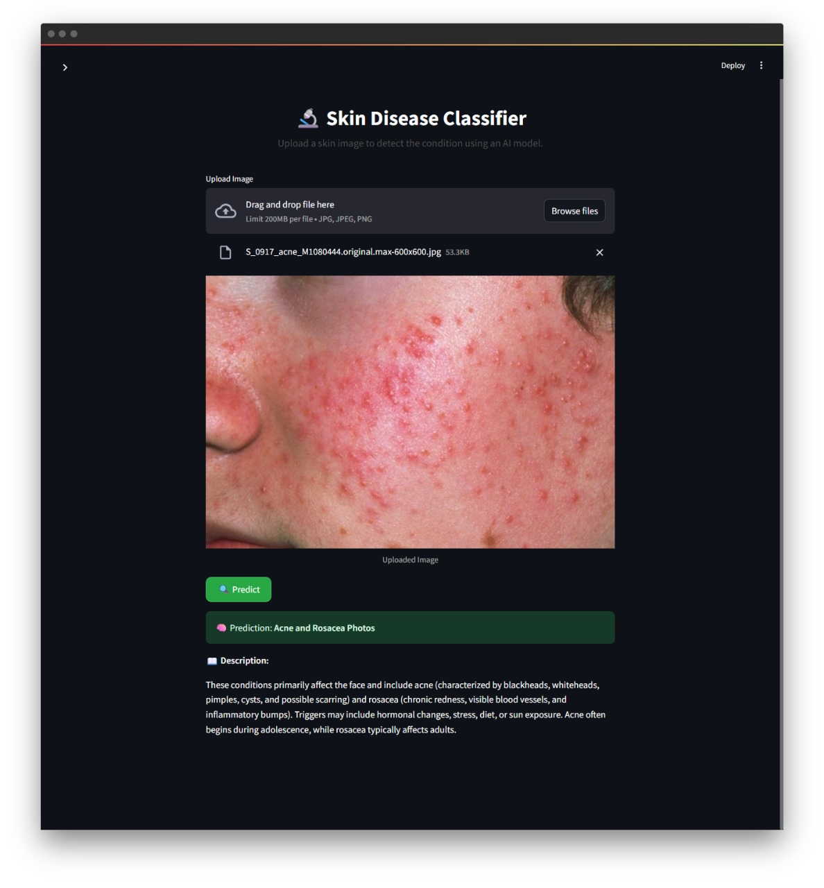

# AI Clinic Digital Health Hub

## Overview

The **AI Clinic Digital Health Hub** is a comprehensive AI-powered platform designed to enhance healthcare diagnostics and patient support. It integrates several predictive and classification models for heart disease risk, pneumonia detection, mental health support, skin condition diagnosis, and personalized skincare product recommendations.

## Features

### 🫀 Heart Disease Risk Prediction
- **Why**: Cardiovascular disease is a leading cause of death globally.
- **How**: Predicts individual risk using personal health and lifestyle metrics.
- **Tech**: `XGBoost (scale_pos_weight)`, `Streamlit`, `Plotly`
- **Input**: User form (age, BMI, smoking, etc.)
- **Output**: Risk prediction + key contributing factors + ROC/AUC & Confusion Matrix

### 🧠 AI Therapist
- **Why**: Provides stigma-free, real-time emotional support.
- **How**: Offers empathetic, guided self-reflection and session summaries.
- **Tech**: `Ollama (LLaMA3-8B)`, `LangChain`, `Streamlit`

### 🫁 Pneumonia Detection
- **Why**: Early detection from chest X-rays aids treatment.
- **How**: Classifies X-rays as "Pneumonia" or "Normal"
- **Tech**: `EfficientNet-B0`, `PyTorch`, `Streamlit`
- **Accuracy**: **98.4%** | Precision: 98.5%, Recall: 99.2%, F1: 98.9%

### 🧴 Skincare AI Recommendation System
- **Why**: Helps users find tailored skincare products.
- **How**:
  - Detects **skin type** (Dry/Oily/Normal)
  - Identifies **concerns** (e.g., acne, redness)
  - Recommends products using `TF-IDF + Cosine Similarity`
- **Tech**: `PyTorch`, `ResNet101`, `Streamlit`, `Requests`

### 🩺 Skin Condition Classifier
- **Why**: Supports early diagnosis of visible skin conditions.
- **How**: Classifies user-uploaded skin images into medical conditions.
- **Accuracy**: **96.6%** | F1-Score: 0.97

---

## Technologies Used

- `Python`, `Streamlit`, `PyTorch`, `XGBoost`, `LangChain`
- `EfficientNet`, `ResNet101`, `Ollama`, `Plotly`
- `TF-IDF`, `Cosine Similarity`, `Requests`, `Local LLMs`

---

## 📸 Screenshots

### 🏠 Homepage UI

### 🧭 Dashboard Overview

### 🫀 Heart Disease Risk Interface

### 🧠 AI Therapist Chat

### 🫁 Pneumonia Detection Result

### 🩺 Skin Condition Classifier Output

### 🧴 Skincare AI Recommendation Interface

